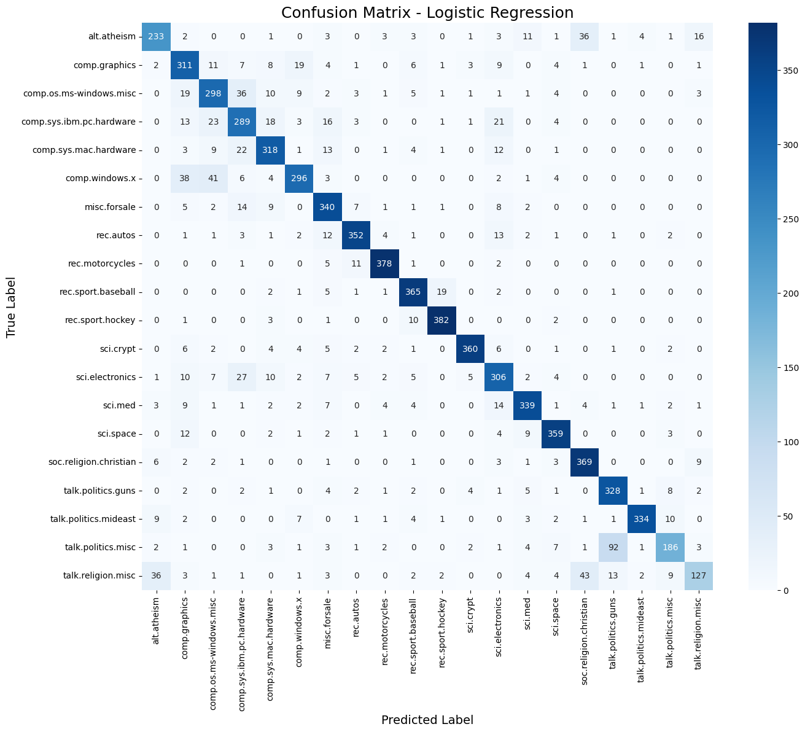

# Text Classification: Naïve Bayes vs. Logistic Regression

## CS 725: Foundations of Machine Learning Project
**Indian Institute of Technology Bombay**

### Team Members
* Pamanji Nagaraju (25m2011)
* Harshit Singh Bhomawat (25m0786)
* Avi Chourasiya (25m2027)
* Sumit Kumar (25m0759)
* Ketan Patil (25m0788)

---

## 1. Project Overview
This project implements and compares two fundamental supervised learning algorithms for text classification:
1.  **Multinomial Naïve Bayes**
2.  **Logistic Regression**

We utilize the standard **20 Newsgroups dataset** to classify text documents into 20 distinct categories ranging from sports and politics to science and religion. The project demonstrates the entire machine learning pipeline, including text preprocessing, TF-IDF vectorization, model training, and performance evaluation.

## 2. Key Results
Our experiments show that **Logistic Regression outperforms Naïve Bayes** in terms of accuracy, likely due to its discriminative nature and ability to model feature dependencies.

| Model | Accuracy | F1-Score (Weighted) | Training Time |
|-------|----------|---------------------|---------------|
| Naïve Bayes | 77.37% | 0.77 | < 1 sec |
| **Logistic Regression** | **83.08%** | **0.83** | ~35 sec |

### Confusion Matrix (Logistic Regression)
The model struggles most with semantically similar categories, such as *Religion* vs. *Christianity* and *IBM Hardware* vs. *Mac Hardware*.



## 3. Methodology
### A. Preprocessing
* **Tokenization:** Splitting text into words.
* **Stop Word Removal:** Removing common English words (e.g., "the", "is") using Scikit-learn's built-in list.
* **Vectorization:** Converting text to numerical vectors using **TF-IDF** (Term Frequency-Inverse Document Frequency).

### B. Models
* **Naïve Bayes:** Uses Laplace smoothing ($\alpha=1.0$) to handle zero-frequency probabilities.
* **Logistic Regression:** Optimized using the L-BFGS solver with a maximum of 1000 iterations for convergence.

## 4. How to Run the Code

### Prerequisites
Ensure you have Python installed along with the following libraries:
```bash
pip install numpy scikit-learn matplotlib seaborn

Running the Script
Clone this repository:

Bash

git clone [https://github.com/NagarajuPamanji/CS725_Text_Classification.git](https://github.com/NagarajuPamanji/CS725_Text_Classification.git)
cd CS725_Text_Classification
Run the Python script:

Bash

python text_classification.py
5. References
Mitchell, T. M. (1997). Machine Learning. McGraw-Hill.

Pedregosa et al. (2011). Scikit-learn: Machine Learning in Python. JMLR.
